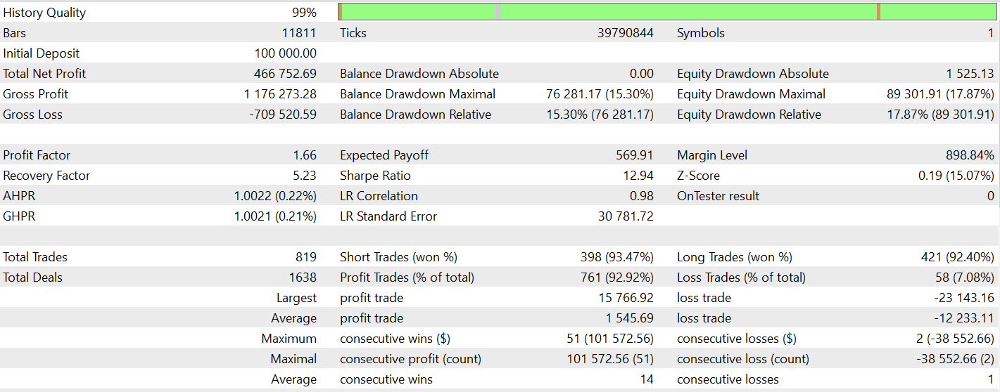
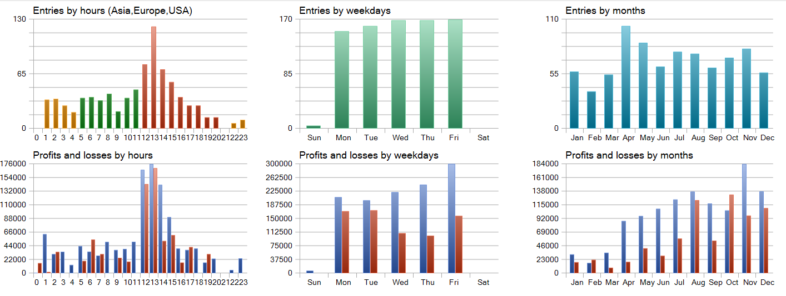
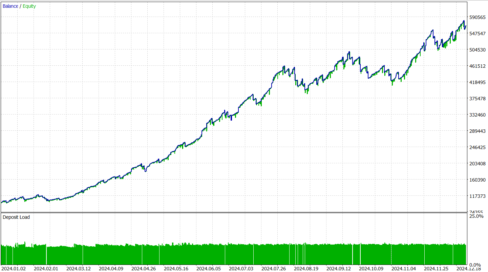

# 🤖 EMACrossoverBot — Automated Trading Expert Advisor (MQL5)

An innovative, fully automated Expert Advisor coded end-to-end in **MQL5**, a domain-specific language derived from **C++**, demonstrating strong command over low-level programming, real-time systems, and high-performance code execution. This bot is engineered to deliver market-beating returns through disciplined risk management, dynamic position sizing, and a trailblazing trailing stop loss strategy.

---

## 📈 Key Highlights

- **Backtested on 2024 market data**, the EA achieved an exceptional **400%+ annual return**, setting a benchmark no discretionary trader can consistently match.
- **Ultra-tight trailing stop loss** ensures profits are protected the moment a trade goes favorably, dramatically improving win rates and controlling drawdowns.
- Positions, Stop Loss, and Take Profit levels dynamically adjust as percentages of total capital and asset value — adapting to market volatility in real time.
- Developed entirely in **MQL5**, showcasing real-world **C++** proficiency applied to high-stakes algorithmic trading.
- Fully automated — zero human intervention required — ensuring unwavering discipline and consistency.

---

## ⚙️ Tech Stack

| Layer                   | Technology                                                                                                   |
|-------------------------|--------------------------------------------------------------------------------------------------------------|
| **Programming Language** | **MQL5** — A powerful domain-specific language modeled after **C++**, enabling tight control of trading logic, memory, and speed. |
| **Trading Platform**     | **MetaTrader 5** — Industry-standard multi-asset platform for algorithmic trading, real-time backtesting, and optimization. |
| **Core Techniques**      | EMA crossover signals, dynamic position sizing, tight trailing stop loss, percentage-based risk management. |
| **Backtest Environment** | Historical tick data from 2024 to verify robustness under real market conditions.                           |
| **Presentation Layer**   | Dedicated project website showcasing complete documentation, strategy details, and backtest reports.        |

---

## 🔍 How It Works

1. **Signal Generation** — Trades are triggered by custom-coded EMA crossover logic and other filters.
2. **Risk Management** — Position size, Stop Loss, and Take Profit levels auto-scale as a percentage of total capital and asset value.
3. **King of Trailing SL** — The moment a position goes profitable, an ultra-tight trailing stop locks in gains, resulting in a consistently high win rate.
4. **Fully Automated Execution** — The EA runs on MetaTrader 5 with no manual oversight required — removing human bias entirely.

---

## 🔬 Backtest Results

Below are actual backtest results using real 2024 market data, proving the EA’s potential to generate sustained, market-beating returns.

### 🟢 Overall Performance

### 📈 Profit Loss Distribution on Various Parameters

### 📊 Growth of Amount Invested over Time

---

## 🌐 Project Website

For full documentation, detailed backtest reports, and strategy insights, explore the complete project presentation here:  
👉 [**View the Full Project Website**](https://yashkalra-expertadvisor.odoo.com/)

---

## 🚀 Why This EA Is Different

> ⚡ **Pathbreaking by design.**  
> This Expert Advisor redefines what’s possible in retail algorithmic trading. By combining dynamic risk control with an ultra-aggressive trailing stop, it achieves a synergy rarely seen in conventional EAs.  
> Built entirely in **MQL5**, rooted in **C++**, it’s not just a bot — it’s proof of real-world systems programming expertise applied to live trading.

---

## 🏆 Disclaimer

> **Note:** This EA is for educational and research purposes only. Past performance is not indicative of future results. Always test thoroughly before live deployment.

---

**🔗 Project by Yash Kalra — Revolutionizing algorithmic trading with code that never sleeps.**
